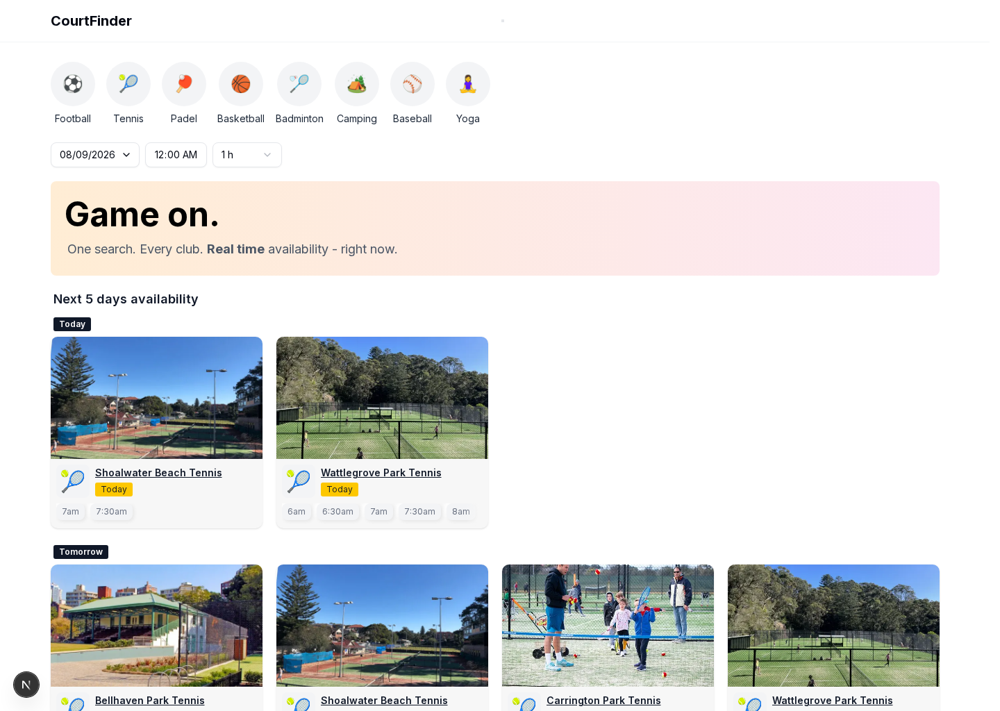

# Court Finder

Aggregates court and session availability across multiple sports clubs into a single searchable view — instead of checking five different booking sites to find a free court, check one.

**[Live demo →](https://court-finder-app.vercel.app/)**



## What it does

Court Finder is a public, no-login browsing experience for finding a court to play on, similar in spirit to how a food-delivery app shows "what's open near me right now." and inspired by the frustration of trying to find an available tennis court in Sydney. Land on the page and immediately see the next few days of availability across every club, grouped by day, with filters for sport, date, time, and duration.

**Key features:**

- **Multi-club aggregation** — one search surfaces availability across every club in the system, instead of visiting each club's own booking page individually.
- **Rolling 5-day landing view** — the homepage defaults to the next 5 days of availability, grouped into clearly labeled sections ("Today", "Tomorrow", "Wednesday 10th (in 3 days)", …) rather than dumping everything into one long list.
- **Smart empty-day fallback** — if a search (or the default 5-day window) comes back empty, the app automatically looks ahead and surfaces the next available days that actually match the filters, instead of leaving the user staring at a blank page.
- **Sport, date, time & duration filters** — narrow results down to a specific sport, day, start time, or session length.
- **URL based search filters** — the search filters are URL based so a search link can easily be shared and it will display the exact same results.
- **Time-slot drill-down** — clicking an available time opens a detail view showing exactly which courts are free at that time.
- **Responsive layout** — usable from a phone at the park just as easily as from a desktop.

## Tech stack

- **[Next.js](https://nextjs.org/)** (App Router) + **React 19**, in **TypeScript**.
- **PostgreSQL**, hosted on **[Neon](https://neon.tech/)** — queried directly with the [`postgres`](https://github.com/porsager/postgres) tagged-template client. No ORM.
- **[Tailwind CSS](https://tailwindcss.com/)** + **[shadcn/ui](https://ui.shadcn.com/)** (built on Radix primitives) for styling and accessible UI components.
- **[Zod](https://zod.dev/)** for validating and parsing search parameters.
- **[date-fns](https://date-fns.org/)** / **date-fns-tz** for timezone-safe date handling.
- Client-side state via React's built-in `useState` and Context — no external state management library.

## Architecture

This repo is the **read-only web front end**. Data ingestion is handled by a separate scraper project (NodeJS, running on a schedule) that writes availability data into the shared Postgres database in a normalized shape. This app never scrapes anything itself — it only acts as the front end for that data, reading `clubs`, `courts`, `sports`, and `availability` tables.

There's no authentication: the whole app is a public browsing surface, so every page is server-rendered from the current URL's search params, with client-side filters that update the URL rather than holding their own separate source of truth (shareable searches).

## Demo data notice

Live scraping is currently paused and mock data is curently on display. Club names shown in the app are **placeholders**, not the original clubs.

## Getting started

```bash
pnpm install

# requires a POSTGRES_URL pointing at a database with the
# clubs / courts / sports / availability schema
pnpm dev
```

Open [http://localhost:3000](http://localhost:3000).

## Project structure

```
app/
├── components/     UI building blocks (filters, result cards, day sections, drawer)
├── lib/            Data access (Postgres queries) and date/formatting utilities
├── store/          React Context providers for search filters and the details drawer
├── ui/             Smaller presentational/skeleton components
└── page.tsx        The landing page
```
